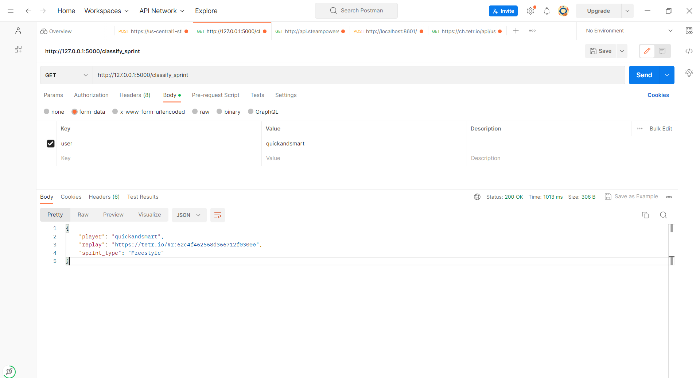

# Tetris Sprint Stacking Classification

## Project Description

The Project is meant to be a classification model of a player's stacking style in the sprint on on the popular web browser game Tetr.io. I used the Tetr.io api to grab the current Tetra League leaderboard and grabbed a sample of users and then got the replay data of each of their sprint pbs. I then manually watched the replays and noted their stacking styles, which is what the model would be trying to classify. After the data collection, I did some cleaning and exploratory data analysis on the statistics for each stacking styles and their distribution based on a player rank. After that I trained and tested Random Forest, Gradient Boost, and K Neighbors Classifiers with hyperparamter tuning to find the best model. Lastly I created a simple client api using Flask that takes in a players username and returns their sprint pb's predicted classification and a replay of their pb.

## Overview of Sprint and Stacking Styles

In modern tetris games, the most popular singleplayer gamemode is sprint, where the goal is to try and clear 40 lines as quickly as possible. There's several different strategies used from players of a variety of skill levels and this project is meant to see if there's easy ways to distinguish the type of stacking based purely on data. 
### Tetris Stacking
The first popular strategy is stacking for just tetrises/quads, however there is many varieties in how this is done. The most common one you'll see is known as  9-0 stacking which is stacking for tetrises in the right most column/well. The reason for the name is because there are 9 columns to the left of the tetris well and 0 columns to the right of it. Simarily there is also 0-9 stacking which is stacking tetrises on the far right well. The last popular tetris stacking strategy is 6-3 where the tetris well is in the 4th column from the right, and this is done so because stacking tetrises in this well helps optimize the amount of key presses needed to place pieces. 

    
    
    

### Freestyle Stacking
Another common strategy is doing freestyle stacking, also commonly refered to as korean stacking in the community, where instead of focusing on quads you focus on clear singles, doubles, and triples and staying low on the board at all times. This strategy is typically only used by players first starting out as they haven't learned proper stacking fundamentals yet, but is sometiems still seen used by high skilled players as it can theoretically provide even lower key presses than 6-3. 

    

### Combo Stacking 
The next popular strategy you might see in sprint is Combo stacking. Combo stacking first originated in multiplayer tetris and involved looking for a large set of line clears all back to back, which is refered to as a combo, where the longer combo you get the bigger the attack each additional line clear sends. There's many forms of this with the simplest one being 2 wide(2w) where you build a tall well that is 2 columns wide and then try to get as big of a combo as possible. Similarly there is 3 wide and 4 wide which is the same strategy but with more columns used in the well. 

    
    

### Loop Stacking
The last stacking strategy you'll see is known as Looping or Loops. While there are many forms of this with names like Stickspin, DPC, and SDPC, the general idea behind it is use of the 7 bag system in modern tetris games. Unlike earlier versions of tetris, the 7 bag system is an algorithm where in every game the queue of tetris pieces is in groups of 7 pieces revered to as bags. These bags contain all 7 pieces in a randomized order everytime, and after one bag is finished another one begins. Loops use this bag system by building setups that can be completed with a high probability with any bag, regardless of the order of the pieces. This allows players to easily reset their board state to one with no pieces on it with perfect/all clears, where they can continue to loop this pattern until the end of the sprint.

    
    
 Credits to fortissim2 for this replay

While there are some other stacking strategies out there, a majority of sprints can be classified into these styles, or a mixture of multiple of these styles in one run. 

## Dependencies and How to Run 

Once you've downloaded the files first make sure you have the correct package versions. To do so open up the command prompt and move the **'server'** directory, then run the command **'pip install -r requirements.txt'** and wait for all of the packages to finish installing. Then you should be able to run the command 'python server.py' which will start running the local flask server for you. After that you can use a service like postman to return the output of their classified sprint and a replay you can watch as well, as seen in the screenshot below. You can find a list of the of players to try this out on here https://ch.tetr.io/players/

## Limitations
One limitation in terms of this project was that the only way to get a sample of users was through the tetra league leaderboard, which meant the training data was only on players who have at least some experience with multiplayer tetris. This means the model may not accurately reflect the whole tetr.io player base, including a majority of players who have not played tetra league. Another limitation is the fact that the actual stacking style had to be manually collected by me, which adds some subjectivity to the sprints, especially the mixed runs where its not as easy to identify the exact stacking style of a run. As for the model, it does seem to struggle with 9-0, 0-9, and 6-3 as they are all tetris stacking and there's no easy way to differentiate the differences with the variables provided in the replay data.  

## Future Work

I mentioned in the model building notebook that this project was initially ment to be for a multi label classification model by including the actual stacking styles used when a player had a mixture of multi. However with the testing I did, it have relatively low accuracy likely do to the difficulty in differentiating stacking styles like I mentioned in limitations. In the future I'd like to address this by potentially adding more training data to work with, and feature engineering some variables that might help in identifying differences. 
